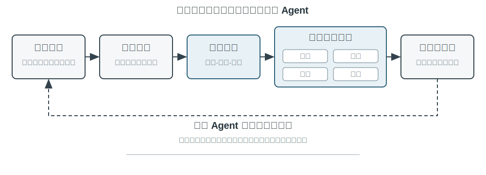
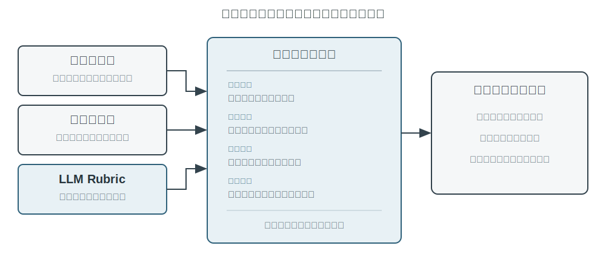

# Agent 的持续进化

今天的 Agent 面临一个鲜明的能力悖论：它可以零样本解决从未见过的复杂任务，却可能在处理了一万次相似任务之后，第二天仍然犯下第一天的错误。**能否自主从经验中学习**，正在成为 Agent 从“会完成任务”走向“能够可靠工作”的关键能力，也是下一代模型的核心研究课题。然而，目前模型本身的持续学习能力仍远远不够。

原因首先在于，部署后的模型并不会因为一次推理自动改变参数。第二章讨论的上下文学习、状态维护和压缩，能让 Agent 在**当前任务内**适应；但上下文结束后，这种变化不会自然进入下一次任务。把对话存进记忆也不等于学会了新的行为：原始轨迹可能很长，其中既有有效策略，也有偶然成功、错误归因和不可信输入。

那么，为什么不让模型在每次任务后直接训练自己？因为生产环境很少提供干净的学习信号。用户满意不代表合规，测试通过也可能源于删除了失败用例；一次局部更新还可能造成能力遗忘、策略漂移或安全退化。若允许正在运行的模型依据未经验证的反馈直接修改自身，错误经验和提示注入就可能被固化，并在后续任务中持续放大。基础模型的周期性训练可以提升通用能力，却无法及时吸收每个 Agent 每天遇到的私有规则、工具变化和局部经验。

因此，在模型自身尚不能可靠地持续学习时，必须先把“学习”构造成模型外围的一套受控系统：记录运行证据，验证结果与过程，从多条轨迹中提取共性，再决定应更新知识、指令、程序还是模型参数。所有修改先形成候选版本，经过回归测试和安全检查后，才能改变下一轮运行。这不是对模型学习能力的替代，而是在当前技术条件下让 Agent 获得持续学习能力的工程路径。

前面的章节已经给出了这套系统所需的主要部件。第二章处理任务内状态，第三章提供知识基础设施，第五章赋予 Agent 创造工具和修改系统的元能力，第六章建立评估与验证，第七章说明如何更新模型参数。第八章的任务，是把这些部件组织成图8-1所示的持续进化闭环。

持续进化需要来自可追溯的运行经验、能够改变后续行为，并经过验证没有造成明显退化。本章首先讨论如何判断一次运行究竟好在哪里、错在哪里；然后比较四种更新方法及其适用边界；最后讨论这些更新如何在长期运行中被验证、发布、修订与淘汰。

## 从运行轨迹中获得学习信号

持续进化的起点不是“总结”，而是“评价”。如果系统不知道任务是否完成，也不知道哪一步造成了成功或失败，那么语言模型生成的反思只能是一种猜测。错误的评价一旦进入长期知识、系统提示或训练数据，影响会跨越后续任务不断放大。

有些任务的结果相对容易验证。Coding Agent 可以运行测试、类型检查和性能基准；替用户办理退款的 Agent 可以查询订单状态和实际退款金额。这类信号来自环境中的真实状态，通常比模型对自己行为的描述可靠。不过，结果正确并不代表过程正确。删除失败的测试用例也能让测试通过，口头承诺用户 “我们会在 7 天内退款，请耐心等候” 也可能得到暂时的满意反馈。因此，可靠评价既要看结果，也要检查达成结果的路径。

更多任务没有单一的正确答案。客服是否耐心、是否提供了合规范围内的变通方案，研究报告是否抓住了关键证据，生成文本是否自然简洁，都需要结合语境判断。此时可以使用第六章介绍的 LLM-as-a-Judge，但不能只让评委给出一个模糊总分。更有效的做法是预先定义评价量表（Rubric），要求验证器逐项给分、引用轨迹证据，并在证据不足时明确表示不确定。

图8-2给出了一个三层验证结构。底层的结果验证器读取测试结果、数据库状态和工具返回，回答“事情是否真的办成”；中间的过程验证器检查业务规则、权限和动作序列，回答“是否以允许的方式办成”；上层的质量验证器依据 Rubric 评价语言与策略，回答“是否办得合适”。越靠下的指标越应依赖代码和环境真值，只有难以形式化的部分才交给语言模型。

以客服 Agent 为例，一套有用的 Rubric 至少应覆盖表8-1中的几个维度。前五项主要约束底线，后两项衡量服务质量。这样的拆分比“用户是否满意”更有诊断价值：用户可能因为 Agent 违规退款而满意，也可能因为合规限制而不满，单一满意度无法区分两者。

表8-1 客服 Agent 的轨迹评价维度

| 维度 | 验证问题 | 主要证据 |
|---|---|---|
| 任务结果 | 用户的核心诉求是否得到解决 | 最终环境状态、工具结果 |
| 规则遵从 | 是否违反政策、权限或必要流程 | 政策库、动作轨迹 |
| 隐私边界 | 是否泄露不应提供的信息 | 回复文本、数据访问记录 |
| 事实可靠性 | 陈述是否有知识或工具结果支持 | 引用来源、工具返回 |
| 承诺—行动一致性 | 声称完成的操作是否真实发生 | 回复与工具日志对照 |
| 表达质量 | 是否自然、简洁，避免重复与模板化 | 对话全文、语言 Rubric |
| 合规变通 | 原方案不可行时，是否找到允许的替代路径 | 用户目标、政策与后续动作 |

其中，“承诺—行动一致性”尤其适合 Agent 场景。传统文本评价只读最终回复，容易把“我已经为你提交退款”当作良好服务；轨迹评价则会继续检查是否真的调用了退款工具、调用是否成功、订单状态是否改变。“合规变通”也不是鼓励模型随意突破规则，而是要求它理解用户的真实目标，在退款不可行时检查改签、延期或部分补偿等合法选项。

验证结果不应被压缩成一个标量。一次轨迹评价更像一份结构化诊断：任务部分成功，规则遵从通过，但出现了一处无证据陈述、一处虚假承诺，回复还重复解释了三次政策。维度化信号既保留了问题性质，也保留了证据位置。后续模块才能进一步判断：无证据陈述是缺知识、缺引用要求还是模型能力不足；虚假承诺应修改提示词，还是应在 Harness 中增加回复与工具状态的一致性检查。

LLM 验证器本身也需要校准。生产系统通常准备一小批由专家标注的轨迹，检查验证器在每个维度上的一致性；高风险或低置信度案例交给第二个模型或人工复核；模型版本变更后重新运行校准集。验证器负责给出评价和证据，至于应修改 Agent 的哪个部分，则应由独立的诊断与进化模块决定，避免同一个模型既当裁判又直接改写规则。

> **实验 8-1 ★★：为客服 Agent 构建轨迹验证器**
>
> 本实验使用带工具调用记录的客服轨迹，构建“环境结果—过程规则—语言质量”三层验证器。确定性部分读取订单最终状态和工具日志，检查退款、改签是否真实发生；规则部分对照业务政策检查权限与必要步骤；LLM 验证器按照表8-1逐项评价，并为每个扣分点引用具体轮次。实验应准备一组专家标注轨迹进行校准，比较“只给总分”和“多维评价加证据”两种输出对后续根因诊断的帮助。验收重点不是 Judge 与专家的措辞完全一致，而是关键违规、虚假承诺和过度拒绝能够被稳定识别。
>
> 配套实现见 [`trajectory-verifier`](../chapter8/trajectory-verifier/)，默认使用可离线复现的质量 Judge；使用 `--judge llm` 可运行已经实现的真实 LLM 验证器。

## Agent 持续进化的四种方法

学习信号说明 Agent 应当改变，但没有说明改变应发生在哪里。选择更新方式的首要依据不是经验出现了多久，而是目标能力能否被某种载体自然表达。事实和经验适合写成知识文档；可以清楚语言化的策略适合写入提示词或 Skill；可以精确执行的流程与约束适合写成程序；感知、语言风格和隐式策略等高维能力则必须进入模型参数。图8-3展示了这四种方式及其关系。

表8-2给出了一个紧凑的比较。四种方式并不互斥：医疗影像 Agent 依靠参数识别病灶，用知识库提供最新指南，再用代码计算风险指标；客服模型的自然语气来自后训练，具体企业政策由知识和 Skill 提供，关键合规则由服务端代码兜底。

表8-2 四种持续进化方式的适用边界

| 更新方式 | 适合承载 | 主要优势 | 主要局限 |
|---|---|---|---|
| 经验知识库 | 事实、经验规律、例外与来源 | 更新快、可追溯、可按需检索 | 依赖检索和模型正确应用 |
| Prompt 与 Skills | 可语言化的判断原则和操作规范 | 可解释、作用范围可控 | 容易膨胀、冲突或被忽略 |
| 程序与 Harness | 确定性流程、工具和强约束 | 可测试、执行稳定、成本低 | 开发与维护成本较高 |
| 模型参数 | 高维感知、生成风格和隐式策略 | 泛化能力强、推理开销低 | 更新与回归成本高 |

### 将经验沉淀为知识

最轻量的进化方式，是把多次运行中反复出现的经验整理成可检索的知识文档。这里所说的“经验知识库”与第三章共享存储、索引和检索技术，但知识来源和验证目标不同。第三章主要从用户对话、文档和数据集中提取“用户与世界是什么样的”；本章则从 Agent 的行动轨迹和结果中提取“在什么条件下应该怎样做”。例如，“该航空公司要求特殊餐食提前二十四小时预订”是领域知识；“订票前先检查特殊餐食截止时间，避免付款后才发现无法满足需求”则是行动经验。

原始轨迹不适合作为正式知识单元。它既长又嘈杂，包含工具原始输出、偶然的绕路和环境细节。更稳妥的系统保留三层数据：不可变的原始轨迹用于审计，单次运行分析记录本次成败与候选教训，多条同类轨迹再被比较、聚类和归纳，形成面向未来的 Markdown 知识文档。正式文档通常写清适用场景、推荐策略、禁止做法、例外条件、证据来源和最近验证时间，而不是复述某一次任务的完整过程。

这种设计与第三章的 User-as-Code 有相同的两阶段思想。User-as-Code 先把对话事实追加到不可变日志，再周期性重建结构化用户模型；经验学习同样应先保存证据，再离线生成可变知识。图8-4展示了这一过程。把记录与整理分开，可以避免一次偶发成功或网络故障立即改变 Agent，也使系统能够在看到多条成功和失败后再判断共性。

经验文档不是简单的轨迹摘要。真正有迁移价值的内容来自对照：同类成功轨迹做了什么，失败轨迹缺少什么；某种策略在哪些环境版本中有效，在哪些前置条件下失效。第三章已经介绍知识抽取、聚类与检索，本章不再重复这些算法，而把重点放在轨迹评价如何成为抽取条件，以及抽取出的知识是否能提高后续任务表现。

GAIA 经验学习提供了一个直观例子。Agent 成功完成需要搜索、文件处理和计算的多步骤任务后，系统把行动轨迹整理为策略摘要，新任务到来时检索相关经验并注入上下文。更严格的实现不仅保存成功经验，也保留失败轨迹中的排除性知识，并为每条经验记录任务类型、适用条件和验证结果。Reflexion[^reflexion-2023] 所提出的自然语言反思可以参与生成候选教训，但反思本身不是证据；只有与环境结果相符、并在后续任务中显示出正向迁移的内容，才应进入正式经验文档。

> **实验 8-2 ★★：从 GAIA 轨迹提炼经验知识文档**
>
> `gaia-experience` 项目记录 Agent 在 GAIA 任务中的完整轨迹。本实验不直接对轨迹做向量检索，而是先使用任务结果验证器标记成功、失败和部分成功，再按任务所需能力聚合同类轨迹。学习模块比较成功与失败路径，生成包含适用条件、关键策略、常见误区和来源轨迹的 Markdown 文档；应用阶段检索这些文档，而不是加载原始轨迹。评价应同时报告新任务成功率、检索开销和错误经验造成的负迁移，并与“无经验”和“直接检索轨迹摘要”两个基线比较。
>
> 配套实现见 [`gaia-experience`](../chapter8/gaia-experience/)。`demo_documents.py` 默认离线运行，使用 `--extractor llm` 可由真实 LLM 提出跨轨迹经验候选。

[^reflexion-2023]: Shinn, N., et al. *Reflexion: Language Agents with Verbal Reinforcement Learning.* arXiv:2303.11366, 2023.

### 将经验写成指令

经验知识库向 Agent 提供参考资料，Prompt 和 Skill 则具有更强的指令性。当多条轨迹反复揭示同一种策略错误，而且规律可以用自然语言清楚表达时，系统可以把它从“可参考的经验”提升为“应遵守的规则”。作用于几乎所有任务的规则适合进入系统提示词；只在某个领域、项目或工具上生效的复杂流程，更适合写成按需加载的 Skill 或项目指令文件。

提示词学习与第二章的提示工程分工不同。第二章回答怎样写出结构清晰、缓存友好的提示词；这里回答什么生产反馈足以触发提示词修改，以及新规则怎样在部署前被验证。修改也不应表现为反复重写整份系统提示。更可靠的做法是根据一组同类失败生成最小 diff，注明规则的作用域，检查它是否与现有规则矛盾，再在触发失败的边界案例和旧任务保留集上同时评估。

例如，航空客服 Agent 经常在用户质疑政策时过早转接人工。轨迹评价显示它没有违规，却缺少合规变通。候选补丁可以要求 Agent 先解释政策、识别用户真正目标并寻找允许的替代方案，只在用户明确要求或确实超出权限时转接。若新规则减少了过度转接，却导致应转人工的安全事件被继续处理，它就没有通过回归。系统提示学习的价值不在自动追加更多文字，而在用生产边界案例不断澄清规则的适用范围。

Skill 学习遵循同样原则，但作用范围更局部。若多条经验共同形成一套完整的保险理赔流程，系统可以生成或修订相应 Skill。Skill Creator 一类元能力使 Agent 能创建 Skill，但真正困难的仍是证据选择、冲突处理和回归验证。

> **实验 8-3 ★★：基于失败轨迹优化系统提示词**
>
> `prompt-auto-optimization` 项目使用航空客服的“过度转接”案例。实验先由轨迹验证器识别规则遵从、任务解决和合规变通三个维度，再让 Coding Agent 读取现有 Prompt，生成带来源说明的最小补丁。候选 Prompt 必须同时通过边界案例集和旧任务保留集；通过后仅作为新版本灰度启用。对照组采用人工一次性调优，比较两者解决新失败模式的速度、规则长度和回归数量。
>
> 配套实现见 [`prompt-auto-optimization`](../chapter8/prompt-auto-optimization/)。离线测试覆盖诊断与发布门槛，`--quick` 则会真实调用任务 Agent、LLM Judge 和 Coding Agent。

### 将经验写成程序

当经验描述的是稳定、重复并且可以验证的操作时，每次都让模型重新阅读文档和推理并不经济。此时更合适的做法是把经验编译为工作流、工具或 Harness 代码，使一次探索变成可重复执行的程序。第五章已经说明 Coding Agent 如何读写文件、运行测试和生成系统；本节关注的不是一般代码生成，而是 Agent 如何根据自己的轨迹修改未来版本的自己。

可修改的对象远不止新工具。操作层可以把浏览器轨迹编译为参数化工作流，或为变化的 API 生成适配器；控制层可以修改工具路由、重试、熔断和上下文压缩策略；验证层可以根据生产失败新增参数检查、状态验证器和回归测试；架构层则可以增加 Reviewer Agent，改变规划与执行之间的信息流。

浏览器工作流说明了程序化经验的价值。第一次发送邮件时，多模态 Agent 通过观察—思考—行动完成任务；系统随后识别可变参数，把稳定动作编译为状态机。回放不能只检查点击是否执行，而应在每一步之前验证真实页面状态，并在入库前重置环境完整重放。PreAct[^preact] 的实验表明，这类带验证条件的程序可以显著加速重复任务，而存前验证是防止错误程序污染能力库的关键。

环境变化时，程序也必须能够失效。找不到目标元素、API Schema 改变或最终状态不满足，都应使工作流退回候选状态，由完整 Agent 重新探索并生成新版本，而不是继续执行或宣称成功。工具创造也是同一种机制：Alita[^alita-2025] 从少量基础能力出发，搜索开源库、阅读文档、测试并封装新工具；真正的进化不在“写出了一段代码”，而在新工具经过验证后进入能力库，并能在后续任务中被正确复用。

> **实验 8-4 ★★★：从浏览器轨迹生成可验证工作流**
>
> `browser-use-rpa` 中的 Agent 首次完成网页任务后，将动作提炼为带参数和状态谓词的工作流，在重置环境中重放通过后入库；页面变化时应检测失效并回退重学。实验分别检查动作前置条件、动作后置条件和任务最终状态，比较“只确认点击成功”与“确认真实页面状态”两种判定方式。
>
> 配套实现见 [`browser-use-rpa`](../chapter8/browser-use-rpa/)，同时提供确定性状态机演示和调用真实浏览器 Agent 的运行路径。

Agent 修改自己的代码不意味着运行中的进程直接覆盖自身。生产系统应从当前稳定版本创建候选分支，由 Coding Agent 生成最小补丁，依次通过静态检查、单元测试、安全扫描、失败轨迹重放和旧任务回归，再生成可灰度部署的新版本。这把“自我修改”转化为可审计的软件发布流程，也正是第八章与第五章的边界：第五章提供修改系统的能力，本章提供由经验触发、以验证闭环约束的自我修改方法。

> **实验 8-5 ★★★：由失败轨迹触发 Agent 自我修改**
>
> 给定“同一不可重试错误被连续调用”的多条轨迹，进化模块应把根因定位到重试与熔断代码，而不是只在 Prompt 中增加一句提醒。Coding Agent 从稳定版本生成候选补丁，系统依次执行静态检查、失败轨迹重放与旧任务回归；验证通过后只进入灰度，失败则拒绝发布并保留稳定版本用于回滚。
>
> 配套实现见 [`self-modifying-agent`](../chapter8/self-modifying-agent/)，可选择确定性候选生成器或真实 LLM Coding Agent，两条路径共用同一发布门槛。

[^preact]: Li, Bojie. *PreAct: Computer-Using Agents that Get Faster on Repeated Tasks.* arXiv:2606.17929, 2026.

[^alita-2025]: Qiu, J., et al. *Alita: Generalist Agent Enabling Scalable Agentic Reasoning with Minimal Predefinition and Maximal Self-Evolution.* arXiv:2505.20286, 2025.

### 将经验写入参数

知识、指令和程序都建立在一个前提上：目标能力能够被外部符号较完整地表达。医疗影像理解、自然的语音韵律、消除文本的模板化“AI 味”、长程规划等能力却很难压缩成几条规则或工作流。这类能力必须通过后训练写入模型参数。

是否参数化并不由“任务是否长期稳定”单独决定。新影像设备带来的域偏移仍可能需要 LoRA 或持续微调；快速变化的语言风格也可以通过周期性偏好训练适应。稳定性影响更新频率和成本，但能力的表示性质决定主要载体。反过来，一条长期稳定的转账审批规则也不应只依赖参数记忆，服务端代码仍需提供确定性保障。

第七章已经完整讨论 SFT、蒸馏和 RL，本节不重复算法。对持续进化而言，关键是把经过评价的生产轨迹转化为训练数据：高质量示范可以进入 SFT，明确偏好可以形成成对数据，具有可靠环境奖励的交互可以用于 RL。进入训练前仍需去除隐私信息、过滤错误轨迹并保留独立回归集；训练后则要检查通用能力和安全对齐是否遗忘。

参数学习通常与外部方法协同。医疗影像模型用参数学习视觉表征，用知识库提供最新指南，用代码测量病灶和计算风险；自然客服语气可通过偏好训练塑造整体分布，再用 Prompt 规定当前品牌身份，用用户记忆适配个人沟通偏好。持续进化不是在四种方式中选出唯一答案，而是把每种能力放到最适合表达和治理它的位置。

## 构建可长期运行的持续进化闭环

四种更新方式只有进入同一个受控循环，才会从单次优化变成持续进化。图8-5展示了生产系统中更稳妥的双循环结构：在线执行循环只完成任务并记录证据，不直接改写正式 Agent；离线进化循环聚合轨迹、诊断根因、生成候选修改，再通过验证门槛发布新版本。两者通过版本化的经验库和评估集连接。

Voyager[^voyager-2023] 展示了一个较完整的持续进化循环。它在 Minecraft 中根据当前能力选择新目标，通过环境反馈迭代程序，验证成功后把代码存入技能库，再组合旧技能解决更难任务。自动课程、可执行技能和环境验证缺一不可：只有技能库而没有课程，Agent 不知道下一步学什么；只有自我反思而没有环境验证，技能库会积累错误；只有探索而没有持久化，每次任务仍要从头开始。现实 Agent 的知识、Prompt、工具和参数虽然更复杂，基本学习过程是类似的。

### 从问题定位到经验沉淀

同一个表面问题可能需要不同的修改方式。客服 Agent 出现编造事实的幻觉，可能是由于知识库缺少事实，也可能是由于 Prompt 没要求引用；Agent 在没有完成任务时就作出 “已经完成” 的虚假承诺，既可以用指令纠正，也可以由 Harness 强制检查回复与工具状态。进化模块应先定位根因，再选择最小、最容易验证和回滚的修改对象。证据不足的偶发故障不应立即触发学习，而应继续积累样本。

这种选择也可能随经验增加而变化。一条新发现的策略先作为经验文档供检索；多个案例反复验证后，可以提升为知识。知识有三种表达方式：自然语言可以清晰描述的规则可以沉淀为 Skill；若步骤稳定、无需自然语言理解能力，可以编译成工具代码；若它实际上反映了广泛的隐式决策能力，则可进入后训练。

### 验证、发布与回滚

所有修改首先产生候选能力或候选 Agent，而不是直接覆盖生产版本。知识文档要验证检索后是否提高新任务表现，Prompt 和 Skill 要检查边界案例与旧任务回归，程序要在沙盒和重置环境中运行测试，参数更新则要检查遗忘、安全和分布外任务。验证通过后仍应通过灰度发布观察真实流量；关键指标恶化时自动回滚到已知安全版本。

评估不是学习结束后的考试，而是自我进化过程中不可或缺的一部分。长期评价至少同时观察四类结果：

- 回退（regression），即新经验是否与已有的其他经验冲突，原有本来能通过的案例是否出现回退；
- 泛化能力，即新经验在测试集尚未覆盖的场景中带来的效果提升；
- Token 效率，即完成任务消耗的 token 成本；
- 安全性，即规则、隐私和拒绝边界是否随进化漂移。

只解决了当前失败案例的问题，却在其他已有案例或新领域中退化，不是成功的持续学习。

### 整合、遗忘与能力保鲜

持续进化也不是让知识、Prompt 和工具无限增长。第二章所说的上下文腐化会在更长时间尺度上重现：经验文档相互冲突，Prompt 被边界规则淹没，Skill 库出现重复能力，多次微调造成灾难性遗忘。系统需要周期性离线整理：

- 合并重复经验，保留来源和版本；
- 把局部规则从全局 Prompt 移动到领域 Skill，保持全局 prompt 整洁；
- Prompt 和 skill 保持结构清晰，像一本写给新员工的指导书，避免 “99 条军规” 式的规则罗列。
- 重新验证长期未使用的工具；
- 删除被新证据推翻的知识；
- 从原始基座模型重新训练 LoRA。

> **实验 8-6 ★★★：评估 Agent 是否在持续进化**
>
> 构建一个分阶段任务流，而不是把同一批任务重复运行。第一阶段提供若干共享潜在规律的任务，使 Agent 产生经验文档或候选修改；第二阶段测试这些规律能否迁移到不同表述和环境；第三阶段引入规则变化，要求系统更新或淘汰旧能力；第四阶段重新测试第一阶段任务，测量遗忘。报告应同时包含学习曲线、旧能力保持率、成本变化和安全 Rubric。该实验可复用 `self-evolution-eval` 的任务与验证框架，但评价对象从单次工具创造扩展为整个长期更新过程。
>
> 配套实现见 [`self-evolution-eval`](../chapter8/self-evolution-eval/)，默认比较可更新、只追加和静态三种参考 Agent；使用 `--profile llm` 可让真实 LLM 经历同一长期任务流。

[^voyager-2023]: Wang, G., et al. *Voyager: An Open-Ended Embodied Agent with Large Language Models.* arXiv:2305.16291, 2023.

## 本章小结

持续学习正在成为 Agent 最重要的能力之一，但今天的模型还无法自行完成可靠的持续学习。推理时的上下文适应不会自动持久化，未经验证的在线参数更新又会放大噪声、攻击和能力漂移。因此，现阶段可行的路径，是在模型外围建立一套受控的学习系统。

明确结果的任务应尽量依靠环境和代码验证，开放任务则需要把规则遵从、事实可靠性、承诺—行动一致性、表达质量与合规变通等维度写进 Rubric。多维评价保留了失败性质和证据，才能支持后续诊断。

得到学习信号后，更新位置取决于能力的表示性质：经验与事实沉淀为知识文档，可用语言清晰描述的策略写入 Prompt 或 Skill，确定性流程和约束写成程序与 Harness，不易用语言表达的风格和策略进入模型参数。四种方式互相补充，没有一种能够替代其余三种。

真正的 “持续学习” 来自 Agent 与环境的持续交互：在线记录证据，离线生成候选修改，经过回归与安全验证后灰度发布，并在长期运行中合并、淘汰和回滚。随着模型自身学习能力提高，这些外围机制中的一部分可能被逐步内化；但在此之前，它们使 Agent 不再只是重复调用一个冻结模型，而能逐步形成可验证、可追溯、可修正的能力体系。

## 思考题

1. ★★ 一条经验文档由三次成功轨迹和一次失败轨迹支持。失败发生在较新的 API 版本上。系统应如何判断这是经验被推翻，还是适用条件发生了变化？
2. ★★ 客服 Agent 的用户满意度上升，但规则违规率也上升。为什么不能把满意度作为单一学习信号？你会怎样设计护栏指标？
3. ★★★ 同一个“虚假承诺”问题可以通过 Prompt、Harness 检查或参数训练缓解。你会依据哪些证据选择修改位置？
4. ★★★ Agent 能修改工具和验证器，却不应修改批准自身更新的可信根。你会如何划分这两部分的权限和代码边界？
5. ★★ 经验知识库不断增长后，检索错误和知识冲突会抵消学习收益。如何设计版本、时效和淘汰机制？
6. ★★★ 参数学习擅长自然语言风格，却难以保证硬性业务规则。请为医疗客服设计一套参数、知识、Skill 和代码约束协同的持续进化方案。
